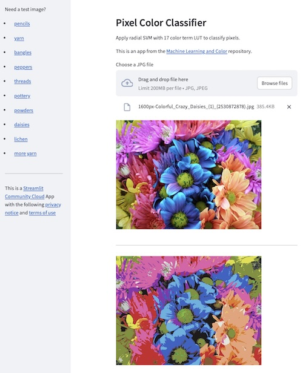

# Pixel Color Classifier

Pixel color classification using a radial SVM trained with 17 color terms.

One of the apps in the [Machine Learning and Color](https://github.com/NMoroney/MachineLearningAndColor) repository.

---

